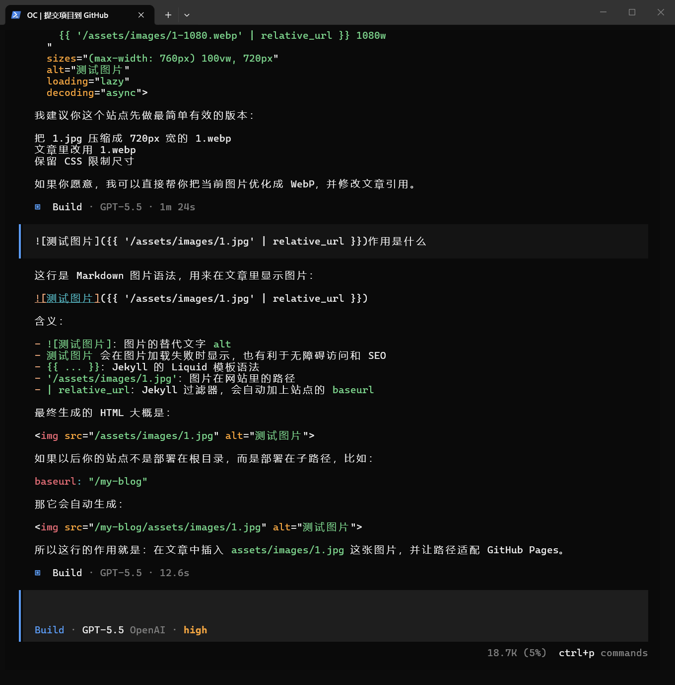

这是第一篇文章。你可以把完整的技术主题写在 `_posts` 目录中。

Jekyll 的文章文件名需要使用这个格式：

```text
YYYY-MM-DD-title.md
```

常用 front matter：

```yaml
---
title: 文章标题
description: 简短摘要
date: 2026-06-29
tags: [engineering]
---
```

## 图片显示测试



